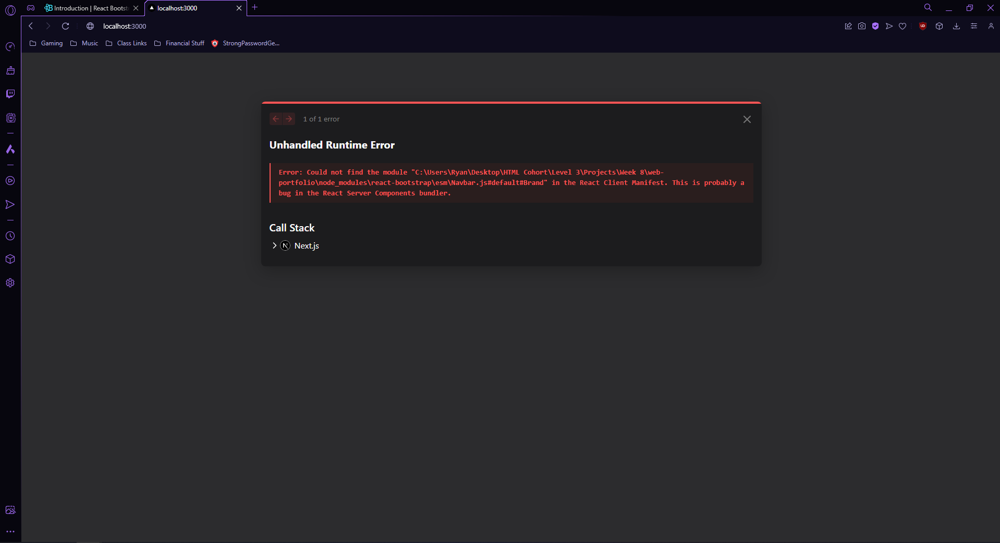
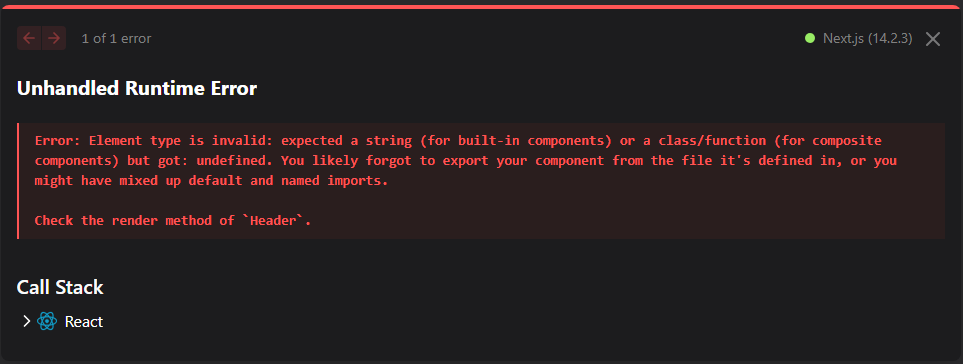

## Day 1 Log

### Tasks Completed

- Initialized the Next.js project with `create-next-app`.
- Began drafting wireframes for the login page and product listing page.
  https://www.figma.com/board/d9qKDHISJiZ1dmFRtGky1m/L3-Capstone---Web-Portfolio?node-id=0%3A1&t=2PBSDIF1aD5C0HFW-1
- Began creating components, starting with Header.jsx
- Created about page.
- Imported Header to about page.
- Finished creating components:
  Footer
  Header
  Hero
  ProjectCard
  Projects

### Challenges and Solutions

- Encountered issues with React-Bootstrap (See screenshot).
  

Solution: Forgot to add 'use client'; to Header component. React-Bootstrap uses client-side rendering, so the components being imported were not being found.

### Learnings and Insights

- Gained a better understanding of React-Bootstrap and how to implement it in my Next.js projects.

### Next Steps

- Add functionality to components.
- Start adding styling.
- Possibly add more components.

## Day 2 Log

### Tasks Completed

- Began constructing ProjectCard component.
- Began constructing Projects component.
- Began linking my projects into the Projects component.
- Created ButtonLink component.
- Added functionality to ButtonLink and animations when hovered or clicked.

### Challenges and Solutions

- Encountered trouble with card images not being properly contained. Also, the card contents were not centered.

Solution:

- Added layout="fill" and objectFit="cover" attributes to Image. This allowed the image to fill its container and cover all available space without stretching the image and reducing its quality.
- Added "relative w-full h-40" to parent className. This set the image position to relative, set the width to take up the full width of its container, and gave it a height setting of 40.

### Learnings and Insights

- Gained a better understanding of Tailwind classNames and their uses.

### Next Steps

- Flesh out About page.
- Possibly add more components.
- Add styling to entire project.

## Day 3 Log

### Tasks Completed

- Added styling to Home page.
- Added styling to ButtonLink.
- Added styling to Footer.
- Added styling to Header.
- Added styling to Hero.
- Added styling to ProjectCard.
- Added styling to Projects.
- Added styling to About page.

### Challenges and Solutions

- Encountered a bug when adding styling to Dropdown menu in Header component. Bug was the result of Bootstrap clashing with styling.
  

Solution:

- Applied bg="dark" and data-bs-theme="dark" to Navbar tag in Header.jsx.

### Learnings and Insights

- Gained a better understanding of Bootstrap and how it interacts with custom CSS styling.

### Next Steps

- Finish styling About page.
- Replace filler text on all pages with relevant information and content. This will likely require adding components to the About page.
- Add code comments.
